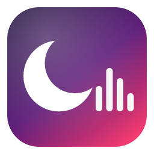
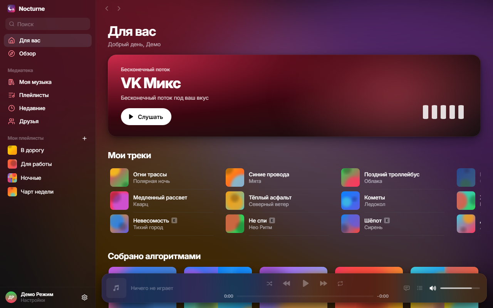
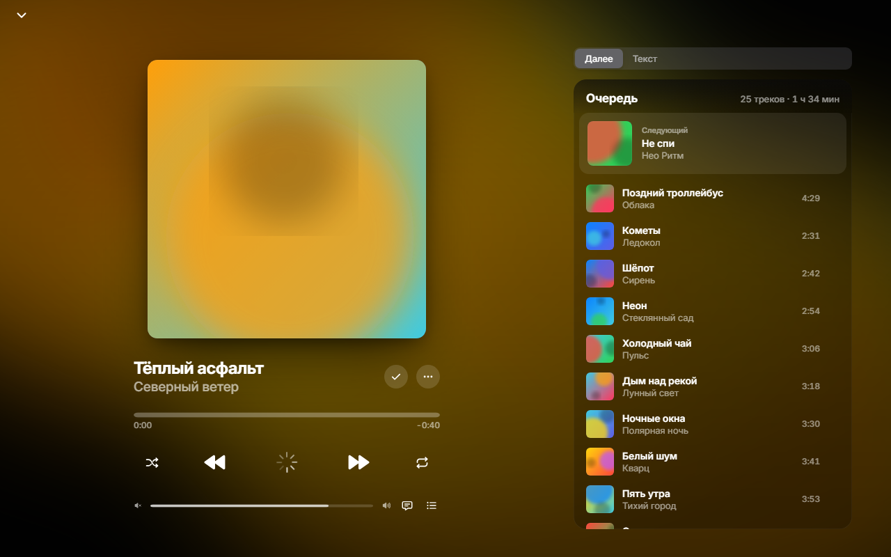
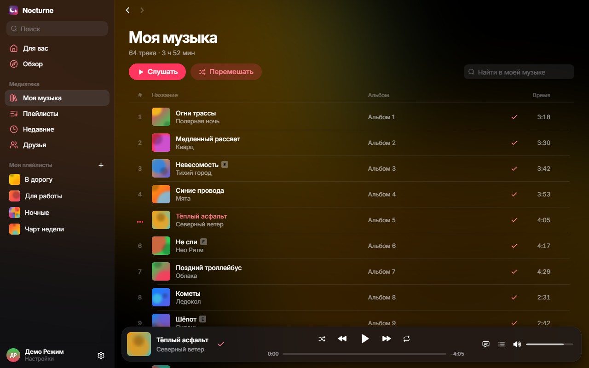

<div align="center">



# Nocturne

**Красивый плеер VK Музыки для Windows** — в стиле iOS / Apple Music, с «островом» сверху экрана, горячими клавишами и живыми обоями.

[**Скачать для Windows**](../../releases/latest) · [Как пользоваться](#как-пользоваться) · [Вопросы](#частые-вопросы)

</div>

> [!IMPORTANT]
> Nocturne — **неофициальный** клиент и **не связан с VK**. Он работает через вашу собственную веб-сессию vk.ru — так же, как браузер. Если VK изменит веб-версию, часть функций может временно перестать работать. Используйте на свой страх и риск.



<table>
  <tr>
    <td></td>
    <td></td>
  </tr>
</table>

<sub>На скриншотах — демо-режим с выдуманными треками.</sub>

## Что умеет

- **Для вас и Обзор** — разделы каталога VK Музыки, бесконечный «VK Микс», подборки «Собрано алгоритмами», новинки и чарты.
- **Моя музыка** — вся медиатека с мгновенным поиском, добавление и удаление треков (с отменой).
- **Плейлисты** — создать, переименовать, удалить, добавить и убрать треки; чужие плейлисты и альбомы можно добавить к себе.
- **Друзья** — музыка и плейлисты друзей (если они её не скрыли), поиск, страницы исполнителей.
- **Сейчас играет** — большая обложка, живой размытый фон, очередь с перетаскиванием, синхронизированный текст песни.
- **Остров** — мини-плеер в духе Dynamic Island: при наведении (или клике) раскрывается — перемотка, громкость, пауза, «в мои аудио». Клики мимо него проходят к окнам под ним, в полноэкранных играх и видео он прячется. Его можно перетащить куда угодно и закрепить.
- **Горячие клавиши** по всей системе, медиаклавиши и плашка Windows с обложкой.
- **Обои** — по обложке трека, анимированные градиенты или свой файл: MP4, WebM, GIF, JPG, PNG.
- Трей, восстановление очереди после перезапуска, автообновления.

## Как пользоваться

1. **Скачайте** `Nocturne_…_x64-setup.exe` со страницы [релизов](../../releases/latest) и запустите.
2. Windows может показать «**Windows защитила ваш компьютер**» — установщик не подписан платным сертификатом. Нажмите **Подробнее → Выполнить в любом случае**.
3. В приложении нажмите **«Войти через VK»**. Откроется окно с настоящей страницей входа VK — войдите по QR-коду из приложения VK или паролем. Окно закроется само, и откроется «Для вас».
4. Готово. Закрытие окна прячет Nocturne в трей (музыка продолжает играть). Выйти — правой кнопкой по значку в трее → «Выйти».

**Остров.** Наведите курсор на чёрную «пилюлю» сверху экрана — она раскроется в плеер. Раскрытый остров можно тянуть за пустое место в любое место экрана; булавка закрепляет его. В «Настройки → Остров» — монитор, режим «по клику», «Вернуть наверх».

**Горячие клавиши** (меняются в настройках):

| Действие | Сочетание |
|---|---|
| Пауза / воспроизведение | `Ctrl` `Alt` `Space` |
| Следующий / предыдущий трек | `Ctrl` `Alt` `→` / `←` |
| Громче / тише | `Ctrl` `Alt` `↑` / `↓` |
| В мои аудио / убрать | `Ctrl` `Alt` `L` |
| Перемотка ±10 с | `Ctrl` `Alt` `Shift` `→` / `←` |
| Перемешать / повтор | `Ctrl` `Alt` `S` / `R` |
| Показать остров / приложение | `Ctrl` `Alt` `I` / `M` |

Внутри окна: `Space` — пауза, `←` `→` — перемотка, `Ctrl+F` — поиск, `Ctrl+L` — в мои аудио.

**Обновления** приходят сами: когда выходит новая версия, в левой колонке появляется кнопка «Обновить». Проверить вручную — «Настройки → О программе».

## Приватность

- Вход — на настоящей странице VK. **Nocturne не видит и не хранит ваш пароль.**
- Доступ к VK (токен веб-сессии) живёт только в памяти приложения: он не сохраняется на диск, не пишется в логи и не уходит никуда, кроме серверов VK (`api.vk.ru`, `login.vk.ru` и CDN с музыкой).
- Никакой аналитики, телеметрии и сторонних серверов. Настройки и очередь хранятся только на вашем компьютере.
- Темп запросов — как у браузера, массовых действий приложение не делает.
- Только прослушивание: Nocturne не скачивает и не сохраняет музыку.
- Обновления подписаны ключом автора и проверяются перед установкой.

## Частые вопросы

**Нужна ли подписка VK Музыки?** Nocturne работает с тем, что вам доступно в VK: с подпиской — без её ограничений, как в браузере.

**Не играет / пропал раздел.** VK мог поменять веб-версию. Проверьте обновления в «Настройки → О программе»; если не помогло — создайте [issue](../../issues).

**VK просит ввести код с картинки.** Это проверка VK «не робот» — введите символы в появившемся окне.

**Как выйти из аккаунта?** «Настройки → Аккаунт → Выйти». Данные входа удаляются с компьютера.

**Остров мешает.** Перетащите его, переключите на раскрытие по клику или выключите в настройках (`Ctrl+Alt+I`).

## Для разработчиков

Нужны Node.js 20+, Rust (stable, MSVC) и Visual Studio Build Tools с компонентом C++.

```bash
npm install
npm run dev            # интерфейс в браузере, демо-режим без VK
npm run tauri dev      # приложение целиком
npm test               # тесты интерфейса; cd src-tauri && cargo test — тесты Rust
```

**Устройство.** Tauri 2 (Rust) + React / TypeScript в WebView2. Rust держит скрытое окно vk.ru, получает в нём короткоживущий веб-токен и сам обращается к `api.vk.ru` (с лимитом запросов и повторами). Потоки HLS играет `hls.js` через загрузчик, который берёт плейлисты, сегменты и ключи через Rust-прокси (только домены CDN VK). Остров — отдельное прозрачное окно поверх всех; Rust следит за курсором и делает «сквозными» области вне формы острова.

**Выпуск версии.** `npm run release -- 0.2.0 "Что нового"` поднимает версию, собирает подписанный установщик и публикует релиз с `latest.json` (нужны `gh auth login` и ключ подписи в `%USERPROFILE%\.tauri\nocturne.key`).

## Лицензия

[MIT](LICENSE). «VK» и «VK Музыка» — товарные знаки их владельцев; проект не использует их логотипы и не выдаёт себя за официальный продукт.
